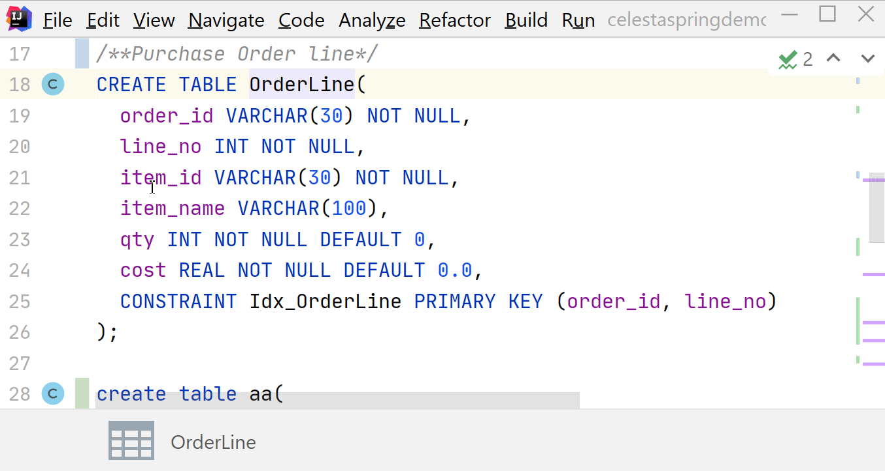

= Celesta IntelliJ Plugin

image::https://ci.corchestra.ru/buildStatus/icon?job=celesta-intellij-plugin/master[link=https://ci.corchestra.ru/job/celesta-intellij-plugin/job/master/]

Offers support for https://github.com/courseorchestra/celesta[Celesta] 

== Features

* CelestaSQL file detection
* Automatic code generation
* Navigation between CelestaSQL and generated classes via line markers