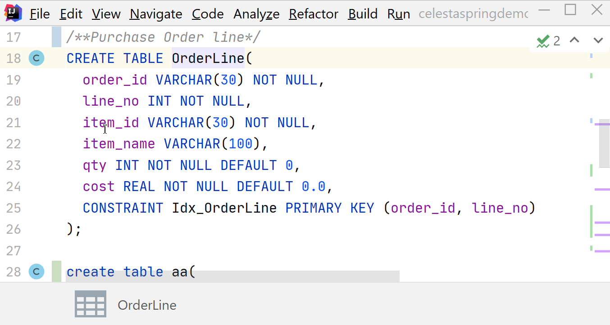

= Celesta IntelliJ Plugin

Offers support for https://github.com/courseorchestra/celesta[Celesta] 

== Features

* CelestaSQL file detection
* Automatic code generation, run in-process via Celesta's API (no Maven goal required)
* Syntax-error highlighting for CelestaSQL files
* Navigation between CelestaSQL and generated classes via line markers
* CelestaSQL preview in Quick Documentation (Ctrl+Q / hover) on a cursor class, with Edit Source (F4) to jump to the `.sql`

== Compatibility

Requires IntelliJ IDEA Ultimate 2026.1 or newer (the plugin builds on the bundled Database, Java and Maven support).
